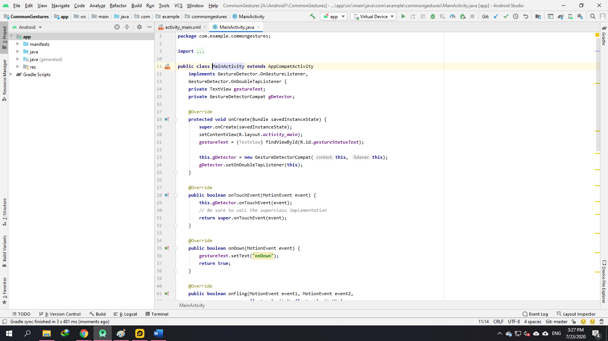
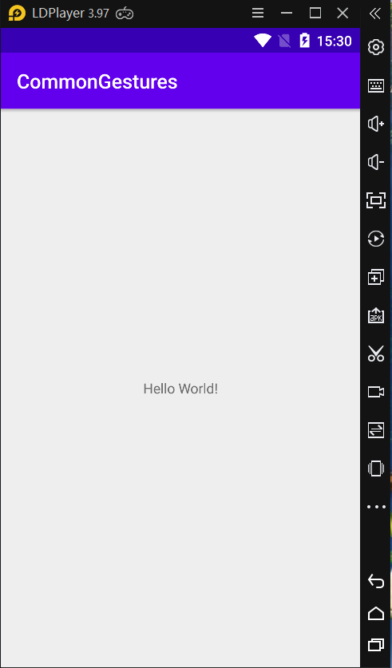
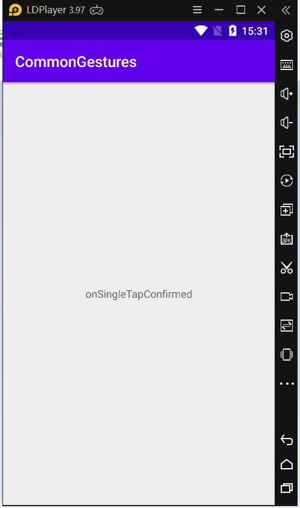

### Phát hiện cử chỉ người dùng với lớp Android Gesture Detector

- <a href= "https://ngocminhtran.com/2018/10/08/phat-hien-cu-chi-nguoi-dung-voi-lop-android-gesture-detector/"> Ứng Dụng Từ Bài</a>

### Yêu Cầu
A. MÔ TẢ VỀ Android Studio:
###Phát hiện cử chỉ người dùng
Như trong bài trước, khi người dùng tương tác với màn hình thiết bị Android, phương thức onTouchEvent() được gọi bởi hệ thống và chuyển đối tượng MotionEvent chứa dữ liệu về tương tác của người dùng với màn hình. Dữ liệu này có thể được dùng để xác định kiểu cử chỉ người dùng bằng cách dùng lớp Android GestureDetectorCompat.

### Các bước cơ bản phát hiện cử chỉ người dùng:

B1: Khai báo lớp thực thi giao diện OnGestureListener gồm các phương thức callback như onFling(), onDown(), onScroll(), onShowPress(), onSingleTapUp() và onLongPress().
B2: Tạo một thể hiện của lớp Android GestureDetectorCompat, chuyển một thể hiện của lớp tạo ở bước 1 (B1) như một đối số.
B3: Nếu cần xử lý sự kiện sau hai lần chạm liên tiếp (double tap) thì có thể gọi phương thức setOnDoubleTapListener() của lớp Android GestureDetectorCompat
B4: gọi phương thức onTouchEvent() của thể hiện lớp Android GestureDetectorCompat
### Ứng dụng minh họa phát hiện cử chỉ người dùng dùng lớp Android GestureDetectorCompat
- Tạo ứng dụng
- Tạo một ứng dụng Android tên CommonGestures, chọn Phone and Tablet và API 14 trong Target Android Devices. Trong Add an Activity to Mobile chọn Empty Activity và nhập CommonGesturesActivity trong Activity Name (tương ứng trong Layout Name là activity_common_gestures) trong Configure Activity.

- Tại tập tin activity_common_gestures.xml chọn chế độ Design, chọn TextView mặc định “Hello, World!” và nhập giá trị gestureStatusText tại thuộc tính ID trong cửa sổ Attributes.

### Thực thi lớp lắng nghe sự kiện (listener class)
- Tạo lớp thực thi giao diện GestureDetector.OnGestureListener và GestureDetector.OnDoubleTapListener (cho sự kiện double tap). Lớp thực thi này có thể là một lớp mới nhưng trong dự án mang tính chất minh họa như CommonGestures chúng ta có thể dùng lớp CommonGesturesActivity để thực thi hai giao diện trên:

### Tạo thể hiện của lớp GestureDetectorCompat

### Thực thi phương thức onTouchEvent()

### Thực thi ứng dụng

- Và thực hiện máy ảo:

- Hiện ra kết quả khi bạn Cilck chuột,...

